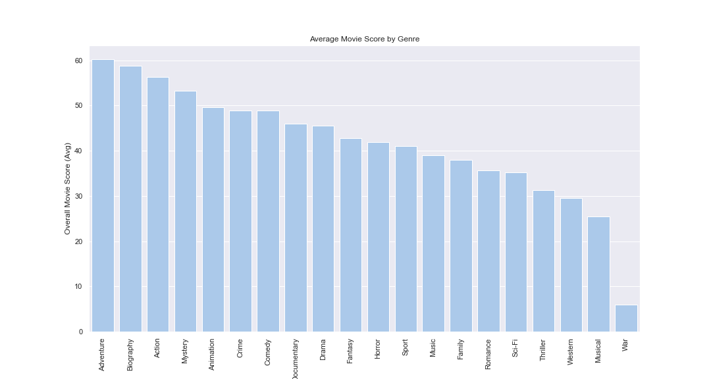

# Microsoft Movie Analysis

**Authors**: Mitchell Ren

## Overview

This Microsoft Movie Analysis seeks to answer the following question: Which types of movies are currently performing best at the box office, and how should Microsoft use this information to break into the market?

The analysis merges data from IMDB and The Numbers to investigate movie genre performance based on key performance indicators. I gave each movie a score based on these indicators and then stack-ranked each one against the rest using percentiles. Finally, I categorized each movie by genre and used bar chart visualization to identify the top 5 performing genres.

I found the top 5 genres to be:
1. Adventure
2. Biography
3. Action
4. Mystery
5. Animation

My recommendation to Microsoft is that the new studio should focus its resources on these 5 main genres to start. I took my analysis one step further by identifying budget ranges and the top talent - including writers, directors, and actors - within each of these categories.

## Business Problem

Microsoft wants to break into the Movie-making business. However, the company has no prior experience doing so. I am tasked with evaluating the market and providing a recommendation on how to proceed.

***
Analysis Questions:
* What are the top performing genres?
* What are the key performance indicators for individual movies? 
* How can we take all KPIs into consideration? 
* Who contributes most to these KPIs? 

***


We first need to understand the market and what movies have been successful. We have metrics in our data that indicate successs in a few different ways. It is important for us to consider at least a few of these metrics so as to ensure our analysis is not too one-dimensional. Once we have a better understanding of categorical trends, we can then focus the rest of our analysis on those categories.

## Data

I will be using two datasets in this analysis - the first being IMDB data stored in a SQLite DB, and the second being a CSV file from The Numbers. The IMDB data gives us information on movie attributes such as: title, genre, runtime, and start year. It also gives us information on movie performance (i.e. average rating and number of votes). Finally, it gives us access to movie talent which we will use to round out our recommendation. The Numbers data gives us access to budget and revenue for each movie which will allow us to calculate Return on Investment.

It is important to note that these datasets do not include the same number of movies. That is, in joining the data we will lose a large number of movies from our analysis. However, I believe the number of movies we are left with is still significant enough to glean insights from. The ROI numbers are crucial. 

I started by investigating the IMDB tables. I found movie_basics and movie_ratings to be the most useful datatsets to start with because they contain both attributes and metrics.

The main variables I was interested in were movie_id, primary_title, genres, averagerating, and numvotes. Once I joined in budget and revenue data from The Numbers, I was able to create an ROI variable. Finally, I created ranking variables for each KPI.

I dropped any rows with null values in the genres column. I felt this was an appropriate course of action because genre was the basis for my categorical analysis. I also dropped many rows in joining data between IMDB datasets and The Numbers dataset. Although this cut the population size down significantly, I still felt there was enough data to produce accurate findings.

## Methods

I started my analysis by combining two tables found in the IMDB SQlite database: movie_basics and movie_ratings. This joined dataset served as the basis for my categorical analysis (movie ratings by genre). Initially, I was just looking at average rating, and then I realized that there were large variances in number of votes. I started to question the validity of purely relying on average rating, because intuitively a movie with a 7.0 rating with only 10 votes should not necessarily be considered equal to a movie with a 7.0 rating with 10,000 votes. I then realized that number of votes should also be factored into my analysis as an indicator of popularity.

I then joined in another dataset - a CSV file from The Numbers which includes budget and revenue. To me, this is a crucial part of the analysis because at the end of the day, businesses are driven by Return on Investment. Now with average rating, number of votes, and ROI - I created a scoring system that ranked each movie against the others using percentiles in each category. I then weighted these 3 factors equally so as to take a more balanced approach than simply choosing one KPI to evaluate success.

With each movie scored and ranked against the rest, I then aggregated by genre to pinpoint the most successful ones. Finally, I found budget ranges and talent pools for the top 5 performing genres.

## Results

I feel that my work gives a solid starting point and general direction for Microsoft to break into the movie-making business. Given the datasets available, I honed in on what I felt to be the most important attributes and metrics. I iterated on my approach and made it less one-dimensional by introducing percentile rankings and further statistical analyses. 

I am confident enough that my results would generalize beyond the data I have, however I do recognize the limitations of my analysis. The sample size I ended up with was much smaller than I would have liked, and this could certainly lead to biases. I am confident though that this analysis would prove useful at least as a starting point for Microsoft.

### Visual 1


### Visual 2


### Visual 3


### Visual 4


### Visual 5


### Visual 6


### Visual 7


## Conclusions

I recommend that Microsoft prioritize the following movie genres with noted budget ranges:

1. Adventure (47 - 97 Million USD)
2. Biography (34 - 62 Million USD)
3. Action (158 - 231 Million USD)
4. Mystery (18 - 48 Million USD)
5. Animation (47 - 97 Million USD)

Within these categories, I recommend Microsoft pursue the writers, directors, and actors listed in the Talent_List.csv file I ended my analysis with. These individuals made major contributions to the top-performing movies in our datasets.

My analysis is not fully comprehensive for the following reasons: It lacks advanced statistical analysis (regression analysis, correlation analysis, etc.) which would better help to identify the most important attributes and metrics to focus on, and the sample size is quite small in the grand scheme - only around 2k movies made it to the fully-combined dataset

In order to improve this project moving forward, I would seek out more data, and incorporate more advanced statistical analyses. I would also try to better-understand Microsoft's specific business situation (i.e. how much money they have to allocate towards this venture). 

## For More Information

Please review our full analysis in [our Jupyter Notebook](./dsc-phase1-project-template.ipynb) or our [presentation](./DS_Project_Presentation.pdf).

For any additional questions, please contact **Mitchell Ren - mitchell.rensei@gmail.com**

## Repository Structure

Describe the structure of your repository and its contents, for example:

```
├── Microsoft_README.md                           <- The top-level README for reviewers of this project
├── dsc-phase1-project-template.ipynb   <- Narrative documentation of analysis in Jupyter notebook
├── DS_Project_Presentation.pdf         <- PDF version of project presentation
├── data                                <- Both sourced externally and generated from code
└── images                              <- Generated from code
```
